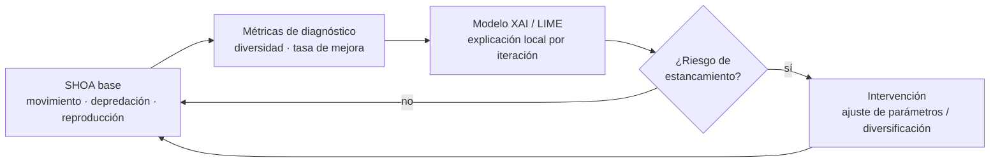
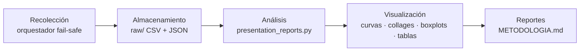

# Modelamiento de la solución — SHOA-COMBINED

> Documento que describe **cómo se diseñó y desarrolló** la solución: la metodología
> de investigación, las técnicas de análisis empleadas y los procesos de datos
> (recolección, almacenamiento, análisis y visualización) usados en este trabajo.

---

## 1. Modelamiento de la solución

La solución propuesta es **SHOA-COMBINED**: el SeaHorse Optimization Algorithm (SHOA)
acoplado a un **controlador en línea** basado en explicabilidad (XAI/LIME) que
anticipa el estancamiento y aplica intervenciones justificadas durante la ejecución.

### 1.1 Arquitectura conceptual



| Componente | Rol en el modelo |
|---|---|
| **SHOA (algoritmo base)** | Optimizador bio-inspirado con fases de movimiento, depredación y reproducción |
| **Métricas de diagnóstico** | Variables internas por iteración (diversidad poblacional, tasa de mejora) que describen el estado de la búsqueda |
| **Módulo XAI (LIME)** | Genera una explicación local de qué métricas conducen al comportamiento observado |
| **Controlador en línea** | Diagnostica el riesgo de estancamiento y decide la intervención (diversificación / ajuste de parámetros) |
| **Mecanismo de intervención** | Reintroduce diversidad o reajusta parámetros para escapar de óptimos locales |

### 1.2 Formulación del problema de optimización

Para cada función de prueba se busca minimizar `f(x)` sobre un dominio acotado:

$$\min_{x \in [L,U]^D} f(x), \qquad \text{error} = \lvert f(x_{best}) - f^{*} \rvert$$

donde `D` es la dimensión (10 o 20), `[L, U]` el dominio del benchmark, `f*` el
óptimo global conocido y el **error** la distancia al óptimo (métrica de desempeño,
menor es mejor).

### 1.3 Algoritmos comparados

| Algoritmo | Papel en el estudio |
|---|---|
| **PSO** | Línea base clásica de inteligencia de enjambre |
| **SHOA** | Algoritmo base sin controlador (aísla el aporte del XAI) |
| **SHOA-COMBINED** | **Método propuesto** = SHOA + controlador XAI/LIME |

---

## 2. Metodología de investigación utilizada

### 2.1 Enfoque

Investigación de tipo **cuantitativa, experimental y comparativa**: se construye un
artefacto algorítmico (SHOA-COMBINED) y se evalúa empíricamente su desempeño frente
a sus referencias (SHOA, PSO) mediante experimentos controlados y contrastes
estadísticos.

### 2.2 Diseño experimental

| Factor | Configuración |
|---|---|
| Benchmark | 12 funciones CEC2022 (F1–F12) vía `opfunu.cec_based.cec2022` |
| Tipos de función | Unimodal, multimodal básica, híbrida y compuesta |
| Dimensiones | D10 y D20 |
| Corridas independientes | 30 por función (semilla base reproducible) |
| Presupuesto por corrida | 200 000 evaluaciones de la función (FEs) |
| Métrica de desempeño | `error = |f(x_best) − f*|` |

### 2.3 Protocolo estadístico

1. **Cálculo de error** por corrida respecto a `f*`.
2. **Emparejamiento** propuesto/referencia por `run_number` (muestras pareadas, n=30).
3. **Verificación de normalidad**: Shapiro-Wilk + Lilliefors (α = 0.05).
4. **Elección de test**: por la no-normalidad generalizada se usa un test **no paramétrico**.
5. **Contraste de hipótesis**: Wilcoxon de los rangos con signo, **una cola**
   (`alternative="less"`), α = 0.05.
   - **H₀:** `µ_prop ≥ µ_ref` (el método propuesto no mejora).
   - **Hₐ:** `µ_prop < µ_ref` (el método propuesto mejora significativamente).
6. **Cuantificación de tendencia**: `delta = error_prop − error_ref`.

> El detalle completo de fórmulas, tablas de resultados y decisiones está en
> [METODOLOGIA.md](METODOLOGIA.md).

---

## 3. Descripción de técnicas de análisis

| Técnica | Propósito | Herramienta |
|---|---|---|
| **Estadística descriptiva** | Resumir el fitness/error por función (best, worst, mean, std, median) | `numpy` |
| **Pruebas de normalidad** | Comprobar si las muestras de error siguen distribución normal | Shapiro-Wilk (`scipy.stats`), Lilliefors (`statsmodels`) |
| **Test no paramétrico pareado** | Contrastar si el propuesto mejora a la referencia | Wilcoxon una cola (`scipy.stats.wilcoxon`) |
| **Análisis de convergencia** | Estudiar la evolución del mejor fitness por FE | curvas media ± std sobre 30 corridas |
| **Explicabilidad (XAI)** | Interpretar qué métricas de diagnóstico anticipan el estancamiento | LIME (contribuciones por iteración) |
| **Análisis de estancamiento** | Detectar y registrar eventos de estancamiento | historial y eventos por corrida |

---

## 4. Descripción de los procesos de datos

### 4.1 Recolección de datos

Un orquestador **fail-safe** ejecuta los tres algoritmos sobre las 12 funciones en
ambas dimensiones. Cada corrida registra:

- el **mejor fitness** alcanzado (`best_fitness`);
- la **traza de convergencia** (`best_fitness_so_far` por FE);
- las **métricas de diagnóstico** por iteración;
- los **eventos de estancamiento** y las **contribuciones LIME** del controlador.

### 4.2 Almacenamiento de datos

Los resultados crudos se guardan en `Resultados/experiments/cec2022_failsafe/raw/`,
organizados por **algoritmo → dimensión → corrida** (`run-AAAA-MM-DD-HH-MM-SS`).
Cada directorio de corrida contiene:

| Archivo | Contenido |
|---|---|
| `runs_raw.csv` | mejor fitness por función y corrida |
| `full_output.csv` | telemetría por iteración (convergencia y métricas) |
| `summary_by_function.csv` | estadísticos agregados por función |
| `stagnation_history.csv`, `stagnation_events.csv` | seguimiento y eventos de estancamiento |
| `lime_contributions.csv`, `global_feature_explanations.csv` | salidas de explicabilidad (XAI) |
| `config_used.json` | configuración exacta usada (reproducibilidad) |
| `plots/` | figuras por corrida (convergencia, clasificación) |

### 4.3 Análisis de datos

El script
[presentation_reports.py](../../../../../Final-Implementation/presentation_reports.py)
**reutiliza los datos ya completos** (no re-ejecuta la optimización) y produce las
tablas de fitness crudo, los resúmenes de error, las pruebas de normalidad y los
contrastes de hipótesis de Wilcoxon, dejándolos en `reports/presentation/tables/`.

```bash
cd Final-Implementation
../.venv/bin/python presentation_reports.py \
    --output-root ../Resultados/experiments/cec2022_failsafe
```

### 4.4 Visualización de datos

| Visualización | Descripción |
|---|---|
| **Curvas de convergencia** | Media de 30 corridas ± 1 desv. estándar, eje Y logarítmico |
| **Collages de convergencia (CEC2022)** | Grilla 3×4 con las 12 funciones por dimensión (D10, D20) |
| **Collages de convergencia (TMLAP)** | Grilla con las configuraciones/instancias de SHOA-COMBINED (convergencia + estancamiento + disparos LIME) |
| **Boxplots** | Distribución del error por algoritmo y función |
| **Tablas comparativas** | Error medio ± std SHOA-COMBINED vs SHOA, mejor resultado en negrita |

Las figuras finales se almacenan en `reports/presentation/plots/` y las tablas en
`reports/presentation/tables/`.

#### Collage de convergencia — CEC2022 (SHOA-COMBINED, D10, run 1)


#### Collage de convergencia — TMLAP (SHOA-COMBINED, run 1)


---

## 5. Variables definidas para la ejecución de los experimentos

### 5.1 Experimento CEC2022 (PSO / SHOA / SHOA-COMBINED)

#### 5.1.1 Parámetros generales de ejecución

| Variable | Valor | Descripción |
|---|---|---|
| `functions` | F1–F12 | Las 12 funciones CEC2022 |
| `dimension` | 10 y 20 | Dimensiones evaluadas (D10, D20) |
| `pop` | 30 | Tamaño de población |
| `max_iter` | 4493 (D10) | Iteraciones (derivado del presupuesto de FEs) |
| `max_fes` | 200 000 | Presupuesto de evaluaciones de la función |
| `runs` | 30 | Corridas independientes por función |
| `seed_base` | 42 | Semilla base reproducible |

#### 5.1.2 Controlador XAI / LIME (solo SHOA-COMBINED)

| Variable | Valor | Descripción |
|---|---|---|
| `lime.enabled` | 1 | Activa el módulo de explicabilidad |
| `trigger_policy` | `stagnation_start_only` | LIME se dispara solo al iniciar estancamiento |
| `pause_during_stagnation` | 1 | Pausa acumulación durante el estancamiento |
| `resume_after_recovered` | 1 | Reanuda al recuperarse |
| `history_window` | `global_from_start_excluding_stagnated_iterations` | Ventana de historial |
| `lime_every` | 225 | Frecuencia de muestreo (auto = 5 % de `max_iter`) |
| `lime_every_strategy` | `auto_5pct_max_iter` | Estrategia de frecuencia |
| `lime_min_samples` | 1000 | Mínimo de muestras para LIME |
| `selection_mode` | `medoid` | Selección de instancia a explicar |
| `stagnation_lime_selection_mode` | `medoid` | Selección durante estancamiento |

#### 5.1.3 Detección de estancamiento

| Variable | Valor | Descripción |
|---|---|---|
| `stagnation.enabled` | 1 | Activa la detección |
| `min_sfes_ratio` | 0.04 | Umbral mínimo de FEs estancadas (ratio) |
| `max_fes` | 200 000 | Presupuesto total de FEs |

#### 5.1.4 Política de reinicio (restart)

| Variable | Valor | Descripción |
|---|---|---|
| `restart.enabled` | 1 | Activa el reinicio |
| `policy` | `stagnation_start_immediate` | Reinicio inmediato al detectar estancamiento |
| `selection` | `worst_fitness_preserve_elite` | Reinicia peores, preserva élite |
| `restart_percent` | 10.0 | Porcentaje de población a reiniciar |
| `restart_range_required` | [5, 10] | Rango permitido de reinicio |
| `cooldown_fes` | 8000 | Enfriamiento (ratio 0.04) |
| `warmup_fes` | 10000 | Calentamiento (ratio 0.05) |
| `lime_dominance_threshold` | 0.9 | Umbral de dominancia LIME para intervenir |
| `lime_dominance_metric` | `relative_importance_per_diagnosis_fused_targets` | Métrica de dominancia |
| `lime_targets_fusion` | `classification_improved`, `regression_y_reg` | Objetivos fusionados |
| `fallback_formula` | `LB + (UB − LB) · rand[0,1]` | Reinicio aleatorio uniforme |
| `fallback_scope` | `restart_subset` | Alcance del fallback |

### 5.2 Experimento PSO-TMLAP (asignación de clientes a hubs)

#### 5.2.1 Parámetros del PSO

| Variable | Valor | Descripción |
|---|---|---|
| `max_iter` | 500 | Iteraciones máximas |
| `n_particles` | 500 | Tamaño del enjambre |
| `theta` (θ) | 0.7 | Coeficiente de inercia |
| `alpha` (α) | 2 | Coeficiente social (hacia `g_best`) |
| `beta` (β) | 2 | Coeficiente cognitivo (hacia `p_best`) |

#### 5.2.2 Parámetros del problema (TMLAP)

| Variable | Valor | Descripción |
|---|---|---|
| `n_clients` | 2201 | Número de clientes (= dimensión) |
| `n_hubs` | 500 | Número de hubs candidatos |
| `dimension` | 2201 | Dimensión de la solución (un hub por cliente) |
| `capacidad` | 6 / 5 (vector, total 2642) | Capacidad máxima por hub |
| `D_max` | 12 | Distancia máxima tolerada cliente-hub |
| `costos_fijos` | vector (15–30) | Costo fijo por abrir cada hub |

> El PSO-TMLAP usa transformación a dominio discreto vía `keep_domain` (sigmoide +
> muestreo proporcional) y valida factibilidad por capacidad y distancia (`check`).
> La función objetivo `fit` minimiza la distancia total de asignación más los costos
> fijos de los hubs activados.

---

## 6. Resumen del flujo


